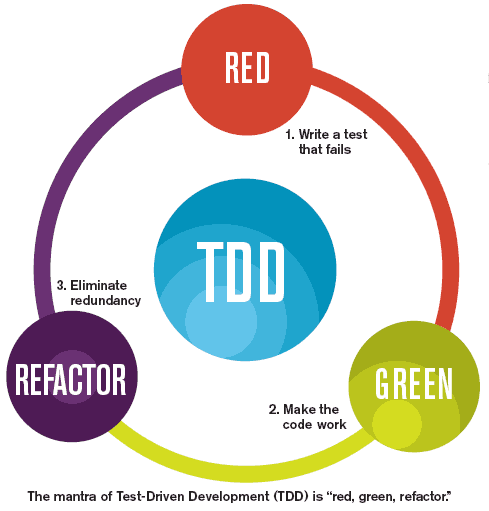

<h1 align="center">
  
</h1>

# Tema da Aula

Turma Online 28 - Imersão JavaScript | Semana 1 | 2023 | [Professora Isabelle Galvão](https://www.linkedin.com/in/isabellegalvao)

### Instruções
Antes de começar, vamos organizar nosso setup.
* Fork esse repositório 
* Clone o fork na sua máquina (Para isso basta abrir o seu terminal e digitar `git clone url-do-seu-repositorio-forkado`)
* Entre na pasta do seu repositório (Para isso basta abrir o seu terminal e digitar `cd nome-do-seu-repositorio-forkado`)
* [Add outras intrucoes caso necessario]

### Objetivo
Entender a importância dos testes de software e escrever nossos primeiros testes.

### Resumo
O que veremos na aula de hoje?
- [Tema da Aula](#tema-da-aula)
    - [Instruções](#instruções)
    - [Objetivo](#objetivo)
    - [Resumo](#resumo)

- [Conteúdo](#conteúdo)

  - [O que é qualidade?](#o-que-é-qualidade)
  - [Por que testar? ](#por-que-testar)
  - [Pirâmide de testes](#pirâmide-de-testes)
    - [Tipos de teste](#tipos-de-teste)
    
  - [Teste Unitário](#teste-unitário)
    - [Quando usar](#quando-usar)
    - [Implementação](#implementação)
    - [Pontos positivos](#pontos-positivos)
    - [Contraponto](#contraponto)
    - [Ferramentas](#ferramentas)
    - [Cobertura](#cobertura)
  - [Pensando em como testar](#pensando-em-como-testar)
  - [Escrita do código](#escrita-do-código)
  - [TDD](#TDD)

  - [Exercícios](#exercícios)
  - [Material da aula](#material-da-aula)
  - [Links Úteis](#links-úteis)

# Conteúdo

https://take.quiz-maker.com/poll4935546x893a4A16-152

## O que é qualidade?

- Pro cliente: bonito, funcional e barato
- Pra empresa: rápido, barato, entrega valor pro cliente

> Faz o que foi pedido? é preciso? Tem boa performance? Oferece segurança? É fácil de usar? Se adapta a necessidade do usuário?

## Por que testar?

- Reduz o tempo gasto em análise e correção de bugs
- Facilita refatoração
- Gera documentação
- Melhora o design do código

## Pirâmide de testes

**Mike Cohn**, que a criou, nos diz em seu livro Succeeding with Agile para agrupar os testes de software em diferentes granularidades.

Ela é um conceito desenvolvido por Mike Cohn que diz que você deve ter muito mais testes de unidade (testes unitários) que testes de GUI (interface gráfica do usuário) que são testes mais a nível de usuário. Como clicar em um link por exemplo.

O Conceito da pirâmide explica o quanto testes de GUI são custosos em relação a testes unitários, pois eles demoram muito mais tempo para serem executados e também são de difícil manutenção, enquanto os testes unitários são muito mais simples, rápidos e baratos.

### Tipos de teste

- Principais:
    - Testes Unitários: Valida se cada unidade de software funciona conforme o esperado. Uma unidade é o menor componente testável de um aplicativo;
    - Testes de Integração: Valida se as unidades do sistema funcionam juntas, integradas. Pode ocorrer delas apresentarem incompatibilidades ao funcionarem em conjunto, mesmo após terem sido aprovadas no teste de unidade;
    - Testes Ponta a Ponta (End-to-End, E2E): Valida o sistema de ponta a ponta, para garantir que o software funcione em todos os sistemas de destino pretendidos;
    - Testes de aceitação: Valida a aprovação do clientes. Os tipos de testes de aceitação são testes alfa, beta e gama;
- Outros tipos:
    - Teste de Regressão: Verifica se novos recursos quebram funcionalidade existentes;
    - Teste de Estresse: Testa quanta tensão o sistema pode suportar antes de falhar.;
    - Teste de Performance/Desempenho: Testa o desempenho do software em diferentes cargas de trabalho;
    - Teste Funcional: Verifica funções, emulando cenários de negócios, com base em requisitos funcionais;
    - Teste de Caos: Testa a integridade, simulando e identificando proativamente falhas antes que elas levem a um tempo de inatividade não planejado ou uma experiência negativa do usuário.

### Sete princípios de teste de software
1. Teste demonstra a presença de defeitos

"O teste fala sobre a presença de defeitos e não fala sobre a ausência de defeitos". O objetivo do teste de software é fazer com que o software falhe. O teste de software reduz a presença de defeitos, mas não pode garantir que o software esteja 100% livre de bugs.

2. Teste exaustivo é impossível

O processo de testar a funcionalidade do software em todas as entradas e pré-condições possíveis - válidas ou inválidas - é conhecido como teste exaustivo. O teste exaustivo é impossível porque o software nunca pode testar em todos os casos de teste, isso demandaria mais custo, tempo, esforço, etc., o que é impraticável. O que fazemos é testar apenas alguns casos de teste e assumir que o software está correto e produzirá a saída correta em todos os casos de teste.

3. Teste antecipado

Incorporar o teste o mais cedo possível no processo de desenvolvimento. Ele desempenha um papel crítico no ciclo de vida de desenvolvimento de software, quanto mais cedo bugs forem identificados mais barato e fácil será a correção.

4. Agrupamento de defeitos

Em um projeto, um pequeno número de módulos pode conter a maioria dos bugs. O Princípio de Pareto (Regra 80-20) para teste de software afirma que 80% do defeito de software vem de 20% dos módulos

5. Paradoxo do Pesticida

Repetir os mesmos casos de teste, repetidamente, não encontrará novos bug. É necessário revisar os casos de teste, e adicionar ou atualizar os casos de teste para encontrar novos bugs.

6. Teste depende do contexto

A abordagem de teste depende do contexto do software desenvolvido. Diferentes tipos de software precisam realizar diferentes tipos de teste.

7. A ilusão da ausência de erros

Se um software construído é 99% livre de bugs, mas não segue o atende às expectativas e necessidades do usuário, então ele é inutilizável.

### Jest
Observação Importante!! Os guias de testes nas aulas utilizam Jest e Cypress, essa escolha foi baseada na performance, funcionalidade e documentação dessas bibliotecas. Como tudo no mundo da programação é extremamente volátil, outras bibliotecas podem se tornar mais adequadas para o ambiente didático, caso isso aconteça sinta-se a vontade para discutir com a Head de Ensino e alterar as orientações dessa ementa.

## Teste Unitário

Um teste unitário basicamente é o teste da menor parte testável de um programa. Se você programa em uma linguagem que suporte paradígma funcional por exemplo, a menor parte testável do seu código deve ser uma função. Então um teste unitário seria o teste de qualquer função. No caso de orientação a objetos seria o teste de um método de seu objeto.

>Testes unitários, assim como qualquer teste automatizados não servem principalmente para verificar se uma função específica está funcionando, mas sim para garantir que sua aplicação continue funcionando após alguma alteração em sua base de código.

### **Quando usar**

- O projeto possui quantidade considerável de lógica
- Existem muitas funções que são reutilizadas em vários lugares
- Possui regra de negócio ou código crucial para o sucesso de fluxos de negócio
- É um produto ou projeto com vida longa
- É um projeto open-source com contribuidores

*Obs: Como saber o que é código de lógica e o que não é? Lógica, na maioria das vezes é puro Javascript, ou seja, se você está acessando o DOM, trocando classes ou animando, isso já é a consequência da lógica, é um efeito colateral de uma decisão. Geralmente funções lógicas são compostas de condicionais (if-else, switch) e loops.*

### Implementação

Um bom teste unitário deve seguir o F.I.R.S.T.:

- Rápido (Fast): Projetos grandes costumam ter muitos testes, tempo é dinheiro.
- Isolado (Isolated): Um teste unitário deve ser executado isoladamente, sem comunicações com sistemas externos ou bancos de dados.
- "Repetível" (Repeatable): Sua execução deve ter resultados consistentes caso não haja nenhuma alteração.
- "Auto-verificável" (Self-validating): O teste deve ser capaz de detectar de maneira automática se passou ou falhou.
- Minucioso (Thorough): Cobrir caminho felizes, infelizes, casos raros (edge cases)

E ainda:

- Simples: Teste devem ser fáceis de implementar e ler, sem repetição do código da função testada.
- Oportuno: A escrita de um teste não deve demorar mais que a escrita do código testado.

### **Pontos positivos**

- *Bugs* são encontrados mais rápido
- Erros são tratados preventivamente
- Mais confiança nos *deploys*
- Facilita o *refatoraçãp* (reescrever funções mantendo os mesmos inputs e outputs)
- Podem ser utilizadas como documentação;

### **Contraponto**

- Mais tempo de desenvolvimento
- Mais tempo de ambientação com o projeto
- Se uma função ou módulo foi mal planejado e precisar ser refeito, o teste precisará ser reescrito também

### **Ferramentas**

- [Tape](https://github.com/substack/tape)
- [Jasmine](https://jasmine.github.io/)
- [Jest](https://facebook.github.io/jest/)
- [Mocha](https://mochajs.org/)
- [Ava](https://github.com/avajs/ava) (*assertion* e *runner*)
- [Karma](https://karma-runner.github.io/1.0/index.html) (*runner*)
- Extras: [Chai](http://chaijs.com/), [Sinon](http://sinonjs.org/)

### **Cobertura**

Ao usar testes unitários como sinônimo de mais estabilidade e segurança, é muito comum o compromisso ou exigência quanto a uma determinada “cobertura”, geralmente medida em percentual. A princípio quanto mais dos seus arquivos Javascript, funções, linhas, condições, enfim, cada operação, é coberta por testes, melhor. Mas existe “**testar demais**”. Um bom meio termo é escolher manualmente arquivos críticos, com regra de negócio ou lógica, e medir a cobertura dos mesmos, ao invés de todos os arquivos em absoluto.

- [Instanbul](https://istanbul.js.org/)

### Pensando em como testar

- O que o código precisa fazer?
- Que dados ele recebe?
- Que dados ele precisa retornar?
- Que ações precisam acontecer para o código rodar?

### Escrita do código

- Nomes de funções e variáveis devem ser semânticos, fáceis de escrever e ler
- Usar verbos para métodos
- Métodos devem ser pequenos, ter uma única responsabilidade, permitir reuso e ser facilmente testável
- Bons códigos não precisam de comentários
- Deixe o lugar (código) melhor do que vc encontrou
- Tenha carinho no início ou conviva com os débitos técnicos

## TDD

[Entendendo Testes de Software - Willian Justen](https://willianjusten.com.br/entendendo-testes-de-software#tdd)

  

TDD é o desenvolvimento de software orientado a testes, Test Driven Development em inglês. Porém mais do que simplesmente testar seu código, TDD é uma filosofia, uma cultura. E foi fortemente adotado e influenciado pelo movimento ágil.

Abordagem evolutiva na qual o desenvolvedor **escreve o teste antes de escrever o código funcional** necessário para satisfazer aquele teste.

O TDD é dividido em três fases: Vermelho (Red), Verde (Green) e Refatoração (Refactor). Passo a passo:

1. Escrevemos um teste para a funcionalidade que ainda será implementada. Como ela não existe, caso o teste seja executado ele deve resultar em erro, ou seja, vermelho!
2. Escrevemos a funcionalidade, e executamos o teste, agora ele deve funcionar, isso é o verde.
3. Se a funcionalidade e o teste funcionam, devemos buscar (se possível) melhorar o que foi codificado. As modificações podem fazer com que o teste falhe, a refatoração deve durar até o teste voltar a funcionar.